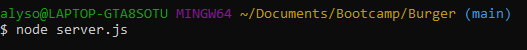
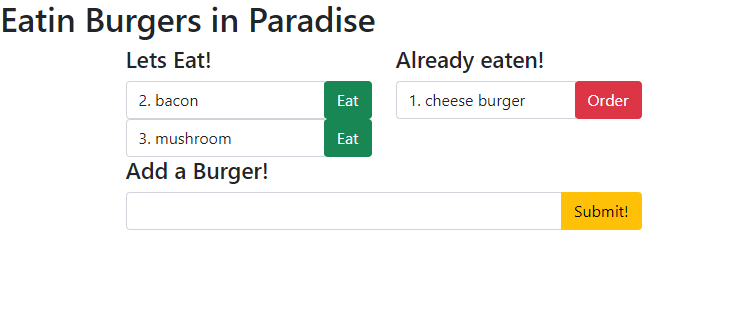

# Eatin Burgers in Paradise App

## Description

Eating Burgers in Paradise is a restaurant app that lets users input the names of burgers they'd like to eat. Whenever a user submits a burger's name, the app will display the burger on the left side of the page. Each burger in the waiting area has a `Devour it!` button. When the user clicks it, the burger will move to the right side of the page. The app will store every burger in a database, whether devoured or not, so the user can track what types of burgers they've eaten.

To try out the app, please visit this [Heroku Link](https://pacific-brushlands-20984.herokuapp.com/)

## Table of Contents

* [Installation](#Installation)
* [Usage](#Usage)
* [License](#License)
* [Contributors](#Contributors)
* [Test](#Test)
* [Questions](#Questions)

## Installation

To successfully run this application from GitHub, please do a npm install upon downloading the repo in your terminal.

```bash
npm install
```

This application comes with seed data to get the user started in the database. You will also have to access MySQL and create the database.  To do so, copy the schema from ```schema.sql``` into your local MySQL. You may also need to change the information in ```connection.js``` to mirror your information. 

## Usage

If accessing this app from the Heroku link, you do not need to install anything to get started! 

To use this application from GitHub, first fork and open the repo onto your local machine. Before attempting to use the app, open your terminal and perform a ```npm install``` to get the necessary packages.


Now, while in the repo, type ```node server.js``` to start the app. 



You can now access the app by going to ```localhost:8080``` in your web browser.



## Credits

Alyson Bennett was the sole collaborator on this project. 

## License

[](https://lbesson.mit-license.org/)

[MIT](https://choosealicense.com/licenses/mit/)

Copyright (c) 2020 Alyson Bennett

## Contributing

Pull requests are welcome. For major changes, please open an issue first to discuss what you would like to change.

[](code_of_conduct.md)

## Tests

There has not been a test script written for this application yet.

## Issues

This application is still under development. Moving forward, the CSS file needs to be worked on to make this application look more like a professional page.  

## Questions

If you have any questions, please contact [Alyson Bennett](https://github.com/alysonbennett) at alysonbennett@gmail.com.